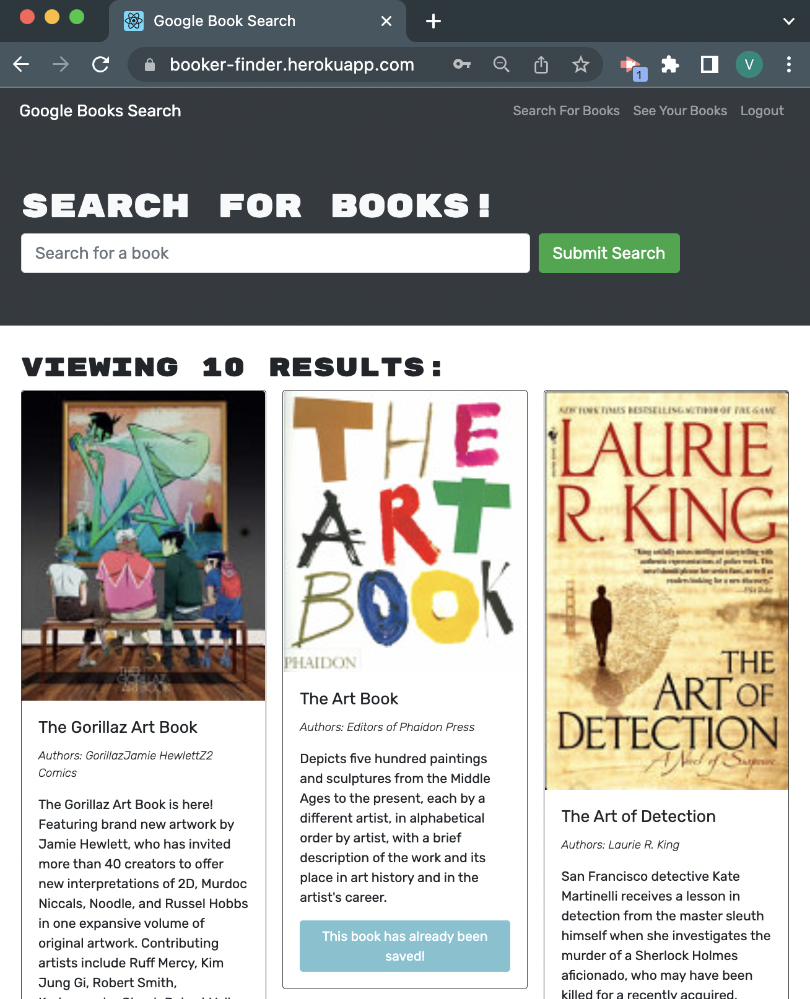

# create-pro-README 
## Description
The purpose of this project is to create an app that allows user to create an account and save books. 

## Table of Contents
- [Installation](#installation)
- [Usage](#usage)
- [Lisence](#lisence)
- [Test](#test)
- [Contributions](#contributions)
- [Lessons Learned](#lessons-learned)
- [Moving Forward](#moving-forward)
- [Screenshot](#screenshot)
- [Live Link](#live-link)
- [Contact](#contact)

## Installation
Download repo [on my Github](https://github.com/vhivestate/book-search-engine)

## Usage
Users have the ability to search for books and if they choose create an account users will also have the ability to save books to their account. 

## License
MIT

## Test
I used npm run develop to run React and Apollo to make sure the app was functioning correctly.

## Contributions
I received a lot of guidance from my tutors and TAs.

## Lessons Learned
Building a MERN stack application. This proved to be the most complicated project I have worked on.

## Moving Forward
I would look like to include the option to also remove a book

## Screenshot

## Live Link
 [live link](https://booker-finder.herokuapp.com/)
 [github](https://github.com/vhivestate/book-search-engine)

## Contact
  If you have any questions feel free to contact me [via email](mailto:garcia.valeria001@gmail.com). or [on GitHub](https://github.com/vhivestate).

